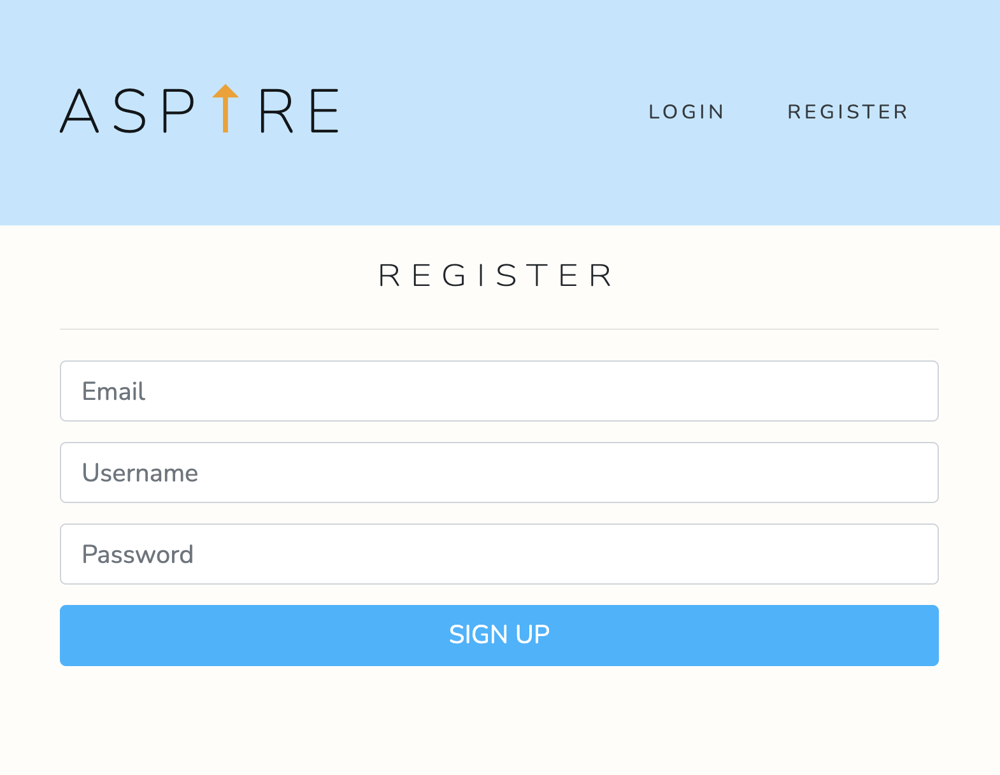
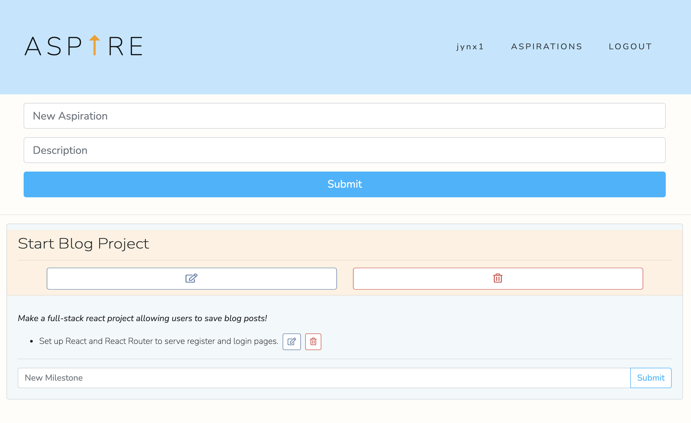

# "Aspirations" To-Do React Application

## Deployed Application

[Aspirations React Application](https://aspirations-mh.herokuapp.com/login)

## Description 

This in-progress full-stack web application allows users to create to-do items called "aspirations" and write notes ("milestones") for them.

When the user navigates to the homepage, they have the ability to login or register a new account using an email, username, and password. When logged into an account, the user can view all saved "aspirations" (including accompanying "milestones") and add a new aspiration with a description. When saved, a user may enter, edit, and delete milestones.

This application stores user data in MongoDB Atlas while online, and authenticated is performed using Passport. Routes are protected using higher-order components which redirect users to/away certain pages whether logged in or not. 

## Features

* Node.js back-end with Express routing. 
* Passport authenticates and authorizes users.
* React front-end with React Router to handle pages.
* React components organize page functions and elements.
* Utilizes React Context API to manage state globally.
* MongoDB/Mongoose stores and retrieves blog posts.
* Incorporates Bootstrap for styling. 

## Credits

Michael Hanson
* michaeledwardhanson@gmail.com
* [GitHub](https://github.com/mhans003)
* [LinkedIn](https://www.linkedin.com/in/michaeledwardhanson/)

## License 

Licensed under the [MIT License](./LICENSE.txt).